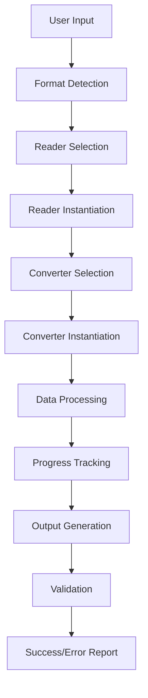

# Project Planning: MSIConverter

This document outlines the high-level architecture, goals, current state assessment, and future development roadmap for the `MSIConverter` project.

## 1. Project Overview

`MSIConverter` is a Python library designed to convert Mass Spectrometry Imaging (MSI) data from various proprietary and open formats into the `SpatialData` format. The primary goal is to provide a flexible, reliable, and extensible tool for MSI data interoperability with a focus on performance and maintainability.

### Current Version
- **Version**: 1.2.0
- **Supported Input Formats**: imzML, Bruker TSF/TDF
- **Output Format**: SpatialData (with zarr storage)
- **Python Support**: 3.12+

## 2. Core Architecture

The project follows a modular `Reader-Converter` pattern with a plugin-based architecture that promotes separation of concerns and allows for easy extension.

### 2.1 Component Overview

*   **Readers (`msiconvert/readers`):** Responsible for parsing specific MSI data formats. Each reader implements the `BaseMSIReader` interface, providing:
    - Format detection capabilities
    - Metadata extraction
    - Spectrum iteration with lazy loading
    - Dimension and coordinate mapping
    
*   **Converters (`msiconvert/converters`):** Transform data from readers into output formats. Each converter implements the `BaseMSIConverter` interface, providing:
    - Template method pattern for conversion workflow
    - Progress tracking and reporting
    - Memory-efficient processing
    - Format-specific optimization
    
*   **Core (`msiconvert/core`):** Foundation classes and utilities:
    - `BaseMSIReader` and `BaseMSIConverter` abstract classes
    - Dynamic registry system for format detection and plugin discovery
    - Common data structures and interfaces
    
*   **Utils (`msiconvert/utils`):** Shared utilities:
    - Data processors for optimization
    - Common algorithms and helpers
    - Performance monitoring tools

### 2.2 Design Principles

1. **Separation of Concerns**: Clear boundaries between reading, conversion, and output
2. **Extensibility**: New formats can be added without modifying core code
3. **Performance**: Streaming and lazy loading for large datasets
4. **Reliability**: Comprehensive error handling and recovery mechanisms
5. **Testability**: Modular design enabling unit and integration testing

## 3. Data Flow

### Detailed Flow:

1. **Input Validation**: Verify file existence and accessibility
2. **Format Detection**: Registry analyzes file structure to determine format
3. **Reader Creation**: Appropriate reader is instantiated with error handling
4. **Converter Setup**: Converter is configured with reader and output parameters
5. **Streaming Processing**: Data is processed in chunks to manage memory
6. **Progress Monitoring**: Real-time updates on conversion progress
7. **Output Writing**: Optimized writing with appropriate chunking
8. **Post-Processing**: Optional optimization steps (e.g., zarr chunk optimization)
9. **Validation**: Basic output validation to ensure completeness

## 4. Key Dependencies

### Core Dependencies
*   **`numpy` (>=1.20.0)**: Numerical operations and array handling
*   **`scipy` (>=1.7.0)**: Sparse matrix operations for efficient data storage
*   **`pandas` (>=1.3.0)**: DataFrame operations for metadata and coordinates
*   **`zarr` (>=2.10.0)**: Chunked, compressed array storage
*   **`dask` (>=2023.0.0)**: Parallel and out-of-core computing capabilities

### Format-Specific Dependencies
*   **`pyimzML` (>=1.4.0)**: imzML file format parsing
*   **`spatialdata` (>=0.2.1)**: Target format for spatial omics data
*   **`anndata` (>=0.9.0)**: Annotated data structures
*   **`geopandas` (>=0.9.0)**: Spatial operations for pixel shapes
*   **`shapely` (>=1.8.0)**: Geometric operations

### Platform-Specific Dependencies
*   **`timsdata.dll/libtimsdata.so`**: Bruker proprietary library (optional, for TSF/TDF support)

## 5. Current Technical Debt

Based on recent analysis, the following technical debt items have been identified:

1. **Logging Infrastructure**: No persistent logging to files
2. **Code Organization**: Some modules have too many responsibilities
3. **Configuration Management**: Hardcoded values throughout the codebase
4. **Error Handling**: Basic exception handling without recovery mechanisms
5. **Test Coverage**: Gaps in error scenario and edge case testing

## 6. Development Roadmap

### Phase 1: Foundation Improvements
**Goal**: Establish robust infrastructure for future development

- [ ] **Implement Comprehensive Logging System**
  - File-based logging with rotation
  - Structured logging format
  - Module-specific loggers
  - Performance metrics collection
  
- [ ] **Refactor Code Organization**
  - Split large modules into focused components
  - Establish clear module boundaries
  - Implement proper separation of concerns
  
- [ ] **Enhanced Error Handling**
  - Custom exception hierarchy
  - Graceful degradation strategies
  - Recovery mechanisms for partial failures

### Phase 2: Performance & Scalability
**Goal**: Handle larger datasets efficiently

- [ ] **Memory Optimization**
  - Implement true streaming for all readers
  - Add out-of-core processing options
  - Profile and optimize memory hotspots
  
- [ ] **Parallel Processing**
  - Multi-threaded spectrum processing
  - Distributed computing support via Dask
  - GPU acceleration for applicable operations
  
- [ ] **Configuration System**
  - YAML/TOML configuration file support
  - Environment variable overrides
  - Runtime configuration validation

### Phase 3: Format Expansion
**Goal**: Support additional MSI formats

- [ ] **New Format Support**
  - Waters (.raw) format reader
  - Thermo Fisher (.raw) format reader

## 7. Success Metrics

### Technical Metrics
- Test coverage > 85%
- All public APIs fully typed
- Zero critical security vulnerabilities
- Conversion success rate > 99%
- Memory usage < 2x input file size

### Performance Metrics
- Convert 1GB imzML in < 5 minutes
- Support files up to 1TB
- Linear scaling with file size
- Chunk optimization improves read speed by > 50%

### User Metrics
- < 5 minute setup time
- Comprehensive documentation coverage
- Active community engagement
- Regular release cycle (monthly)

## 8. Risk Mitigation

### Technical Risks
1. **Proprietary Format Changes**: Maintain vendor relationships and version detection
2. **Memory Limitations**: Implement streaming and chunking strategies
3. **Performance Bottlenecks**: Regular profiling and optimization cycles

### Project Risks
1. **Dependency Deprecation**: Regular dependency audits and updates
2. **Community Adoption**: Active engagement and responsive support
3. **Technical Debt Accumulation**: Dedicated refactoring time each sprint

## 9. Contributing Guidelines

### Development Process
1. Fork the repository
2. Create feature branch from `develop`
3. Write tests for new functionality
4. Ensure all tests pass
5. Submit pull request with detailed description

### Code Standards
- Follow PEP 8 style guide
- Maintain >80% test coverage
- Document all public APIs
- Use type hints throughout
- Keep modules under 500 lines

---

*Last Updated: January 2025*
*Next Review: April 2025*